# Collaborative Deep Learning for Recommender Systems
Recommender Systems are widely used by many companies to recommend products to the target customers. Content-based methods, collaborative filtering (CF) based methods, and hybrid methods are three main categories in the Recommender Systems. Content-based methods generate the recommendation via user profiles or product descriptions. On the other hand, CF-based methods utilize the users' behavioral or preferences datasets, such as user ratings on items, instead of user or product content information. Hybrid methods are the combinations of content-based and CF-based methods. Collaborative deep learning (CDL), hierarchical Bayesian model, learns the deep representation for the content information and applies the collaborative filtering for the ratings (feedback) matrix. CDL model is an advanced approach with the experimentation of the real-world datasets.  
**In this article, you will learn the singular value decomposition and truncated SVD of the recommender system:**  
(1) Introduction  
(2) NOTATION AND PROBLEM FORMULATION  
(3) Stacked Denoising Autoencoders  
(4) Generalized Bayesian SDAE  
(5) Collaborative Deep Learning  
(6) Maximum A Posteriori Estimates  
(7) Prediction
## Introduction
The recommender system, collaborative deep learning (CDL), is introduced as a hierarchical Bayesian model. Stacked denoising autoencoder (SDAE) is known as a Bayesian formulation of a deep learning model. In terms of the CDL model, it combines the content from the deep representation learning and collaborative filtering for the ratings (feedback) matrix, which enables the interaction from two channels. CDL incorporates several techniques such as deep Boltzmann machines, recurrent neural networks, and convolutional neural networks.  
From the CDL model, the parallel implementation for the model includes the extraction of the deep feature representation from content and capture the similarity and implicit relationship between items (and users). Such a method is applied to the task other than recommendation. Collaborative filtering is proposed as a complex probabilistic framework unlike the deep learning model for classification. Apart from the model to get the maximum a posteriori (MAP) estimates, the sampling-based algorithm to tackle Bayesian problems in CDL is proposed, which turns out to be a Bayesian generalized version of back-propagation. From the Bayesian approach in the model, the CDL can capture the auxiliary information for the model improvement.   
## NOTATION AND PROBLEM FORMULATION
The input training and test data into the CDL model takes implicit feedback. The J-by-S matrix Xc is generated from the articles and movies of J items, where j stands for the bag-of-words vector Xc, where row j is the bag-of-words vector X_c_j∗ for item j based on a vocabulary of size S. The I*J binary rating matrix R = [Rij ]_I×J is generated from I users. In the matrix, R_ij=1 where the user i publishes the article j, whereas R_ij=0 when there's no publication for the user I. The task is to predict other ratings in the R matrix given the ratings in R and the content information X_c. The main goals for the model include the movie and article recommendation.  
In the SDAE model, there are 2 matrices with the clean input X_c matrix and the noise-corrupted J*S matrix. There are two input matrices to the SDAE model with X_c as the clean input and noise-corrupted J-by-S matrix X_0. In the output layer l, the output matrix is denoted as X_l with the J-by-Kl matrix.  
X_l_j*: row j of X_l  
W_l & b_l: weight matrix and bias vector   
W_l_∗n: column n of W_l in the layer l   
W+: weight matrices and biases in all layers  
## Stacked Denoising Autoencoders
SDAE is the model to process the input encoding data through the representation learning to produce the predicted output. The neural network structure is shown in the figure 2. Among all these layers, X2 is the middle hidden layer and X0 represents the clean input data.  
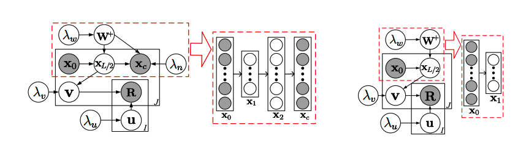  
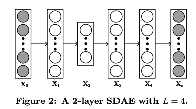  
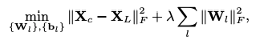  
The graph above is the optimization formula for SDAE, where λ is a regularization parameter and || .||denotes the Frobenius norm.  
 
Figure 1 shows the CDL graphical model, and SDAE graphical model is circled in red. SDAE with L = 2 is shown in graph 2. The graphical model of the degenerated CDL is shown in right, and the SDAE encoder model is shown in the dashed rectangle. There is no decoder in SDAE when L is 2. For better model implementation, variables x1 have vanished and there would be remaining xL/2 remained in the graphical models.  
Figure 1: On the left is the graphical model of CDL. The part inside the dashed rectangle represents an SDAE. An example SDAE with L = 2 is shown. On the right is the graphical model of the degenerated CDL. The part inside the dashed rectangle  represents the encoder of an SDAE. An example SDAE with L = 2 is shown on the right of it. Note that although L is still 2, the decoder of the SDAE vanishes. To prevent clutter, we omit all variables xl except x0 and xL/2 in the graphical models.  
## Generalized Bayesian SDAE
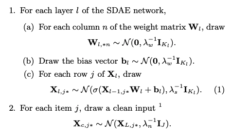  
When the parameter λ_s is infinite, the Equation (1) formula would draw center at σ(Xl−1,j∗Wl + bl), and the Gaussian distribution is transformed into Dirac delta distribution, where σ(·) is the sigmoid function. Generalized SDAE degenerates from the Bayesian formulation of SDAE. The encoder model is denoted as the first L/2 layers of the network and the decoder model is represented by the last L/2 layers. The goal of the model is to maximize the posterior probability equivalent to the minimization of the reconstruction error with weight decay.
## Collaborative Deep Learning
The generative process of CDL is discussed as algorithm1 above and algorithm2 below. 
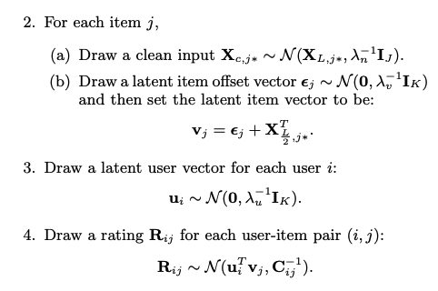  
## Maximum A Posteriori Estimates
From the above CDL model introduction, all parameters are seen as random variables for the application of Markov chain Monte Carlo (MCMC) or variational approximation methods. However, it is required with a high computation cost. The MAP estimates are extracted from the EM-style algorithm, which is the comparison to the CTR baseline algorithm. Similar to CTR, maximizing the joint log-likelihood of U, V, {Xl}, Xc, {Wl}, {bl}, and R given λu, λv, λw, λs, and λn is the same as maximizing the posterior probability.
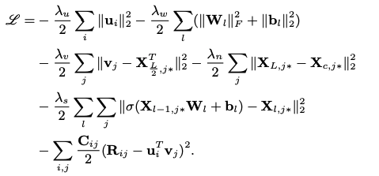  
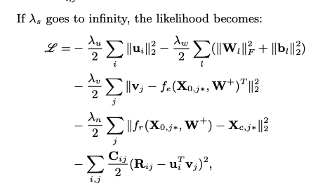  
the algorithm above is objective function  
 
In the encoder function fe(·,W+), the input vector is X0,j∗ of item j, and the encoding of the item is computed. The function fr(·,W+) is input with X0,j∗ with the encodings' computation, and reconstructed content vector of item j. In the 6 layer model with L=6, the output of the third layer is fe(X0,j∗,W+) and the sixth layer is fr(X0,j∗,W+). Regarding the optimization, multi-layer perception is applied to the third term in the objective function (2) above using the latent item vectors vj as target. SDAE is represented in the fourth term with the goal to minimize the reconstruction error. Looking deeply into the neural networks (NN), when λs is close by the positive infinity, the probabilistic graphical model of CDL in the training phase in Figure 1 would be split into two combined training neural networks with a common input layer and the different output layers in the Figure 3. Due to the addition of the rating matrix, it is more complex to build the second network than typical neural networks.  
When the ratio λn/λv approaches positive infinity, there is a split into a two-step model in which the input of CTR (Click through Rate) is fed with the latent representation learned using SDAE. On the other hand, the extreme case would appear when λn/λv shrinks to zero where the decoder of the SDAE essentially vanishes. In Figure 1, it is shown with the graphical model of the degenerated CDL, where the variable λn/λv goes to zero. The predictive result would be varied for both extreme cases when either λn/λv close to positive infinity or 0. With the input of W+, the gradients of L are computed along with ui and vj, and both variables are set with zero. The following update rules are introduced below:
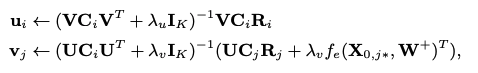  

: diagonal matrix  

: column vector included all the ratings of user i  

: confidence controlled by a and b   
With the input of U and V, the weights Wl and biases bl from each layer are learned through the back-propagation learning algorithm. The gradients of the likelihood regarding Wl and bl are introduced below:
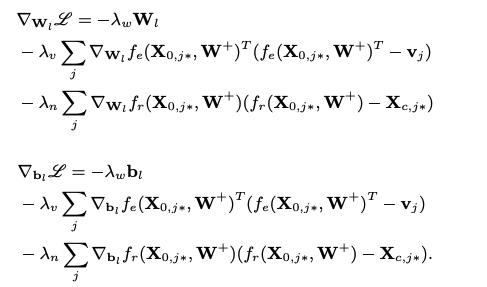  
## Prediction
The observed test data is input with D. Then, the predicted rating is predicted with the input of point estimates such as ui, W+ and j.
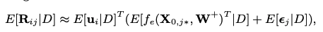  
E[·] is represented as the expectation operation. The following equation shows the approximation of the predicted rating
  png" width="80%" height="80%">  
For any new item j without the rating in the training data, its offset ε^∗_ j shrinks to zero.
## Hands-on experience with python code
## Data Description:
The data is provided from Santander bank with customers' purchase records in 1.5 years for the new product recommendation for the existing users. The start date of the data is 2015–01–28, including customers' monthly records of products, such as "credit card", "savings account", and so on. The latest date of data is 2016–05–28. The goal is to predict the items which customers will buy next month. The test and train sets are split by time. The data is found here.
## Rating Matrix
The rating file is read in h5 format with several data frames stored in it, and the rating file is split with training and test data frames. Given the customers rating data frame, the customers' ID row and product ID columns are input with customers ' ratings.

## User Information
First, we read in the rating training data frame with a total of 551605 users and 24 products. To minimize the computation cost, the data frame shrinks the shape to 50,000. There is a generated data frame with the user information encoding. In the user encoding data frame, there are 2 columns with one customer code, and the other is the encoding array fed with the rating given by the user. Lastly, the user encoding data frame is output with 50,000 users. Besides, there are 340 columns in the data frame with each column given the rating by each user in the row.

## SDAE Model
Intialize weight, bias, and input vectors in the SDAE model with 2 hidden layers. In each iteration of the epoch, the item vector v is updated via $(v_j) = ({U(C_i)(U^T)+(\lambda\_v)I_k}){^{-1}}({U(C_j)(R_j)+(\lambda\_v)f_e}){(X_{0,j*}, w^+)}^T$. Besides, In each iteration of the epoch, the user vector u is updated via $(u_i) = ({V(C_i)(V^T)+(\lambda\_u)I_k}){^{-1}}V(C_i)(R^i)$. In the SDAE model, there are two hidden layers with the latest one taking the previous output. The final output is to compute the vector norm which is computed with the loss of actual and predicted value. 

The norm result is shown in the graph below. Since the SADE model is required with large computation cost, the model is only trained with 5 epochs. The loss norm is ranged from 345 to 375.
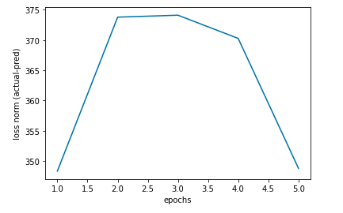  
**norm result**
## In Conclusion
- In the encoder function fe(·,W+), the input vector is X0,j∗ of item j, and the encoding of the item is computed. The function fr(·,W+) is input with X0,j∗ with the encodings' computation, and reconstructed content vector of item j. Looking deeply into the neural networks (NN), when λs is close by the positive infinity, the probabilistic graphical model of CDL in the training phase would be split into two combined training neural networks with a common input layer and the different output layers.
- SDAE is the model to process the input encoding data through the representation learning to produce the predicted output. Generalized SDAE degenerates from the Bayesian formulation of SDAE. The encoder model is denoted as the first L/2 layers of the network and the decoder model is represented by the last L/2 layers. The goal of the model is to maximize the posterior probability equivalent to the minimization of the reconstruction error with weight decay.
- In each iteration of the epoch, the item vector v is updated via $(v_j) = ({U(C_i)(U^T)+(\lambda\_v)I_k}){^{-1}}({U(C_j)(R_j)+(\lambda\_v)f_e}){(X_{0,j*}, w^+)}^T$. Besides, In each iteration of the epoch, the user vector u is updated via $(u_i) = ({V(C_i)(V^T)+(\lambda\_u)I_k}){^{-1}}V(C_i)(R^i)$. With the input of W+, the gradients L in U_i and V_j are set with 0. The weights Wl and biases bl are learned from U and V via the backpropagation. 

## Reference
- Collaborative Deep Learning for Recommender Systems  
https://arxiv.org/pdf/1409.2944.pdf
- Collaborative-Deep-Learning-for-Recommender-Systems  
https://github.com/xiaoouzhang/Collaborative-Deep-Learning-for-Recommender-Systems
